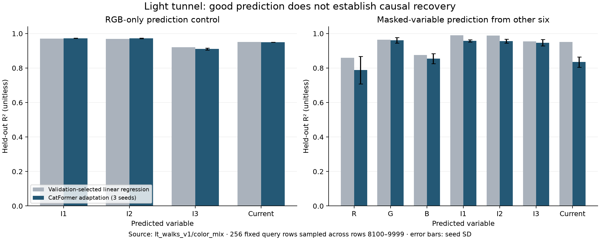
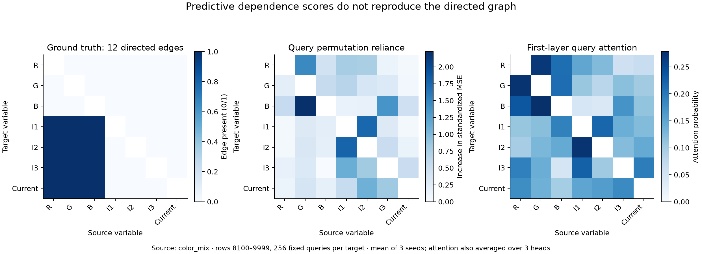
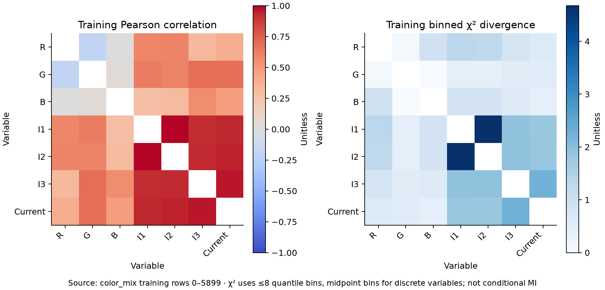
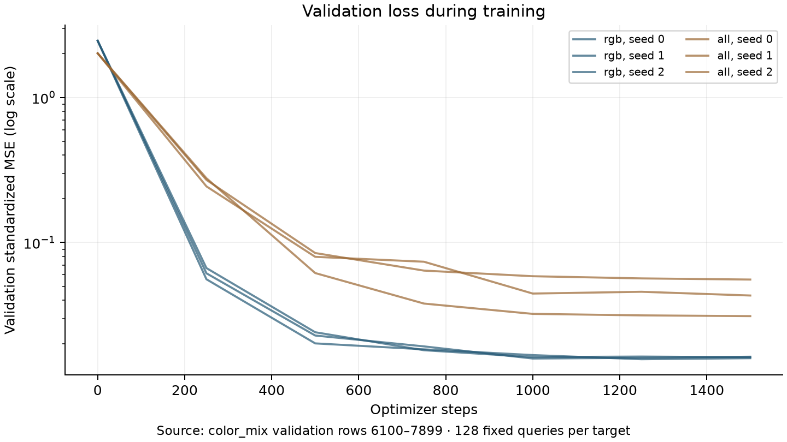

# Light tunnel experiment results

The continuous CatFormer adaptation learns the easy RGB-to-sensor prediction task. It does not recover the directed ground-truth graph using the tested attention or permutation scores.

## Prediction control

Mean held-out R² over three seeds (I1, I2, I3, current): **0.972, 0.972, 0.910, 0.950**. Linear-regression R² on exactly the same query rows: **0.971, 0.969, 0.920, 0.952**. Thus prediction is broadly comparable to the linear baseline; I3 is slightly worse with this adapter.

The synthetic independent-input linear control reaches R² **0.997, 0.997, 0.997, 0.998** (one seed). This is evidence that the continuous adapter can learn a strong linear signal.

## Exploratory graph recovery

The all-variable task predicts each variable from the other six without a supplied causal ordering. There are 42 directed candidate edges, of which 12 are ground-truth positives. Query-permutation importance gives average precision **0.205 ± 0.009** across three seeds. None of the top 12 ranked pairs is a true directed edge in any of these runs. First-layer query attention gives average precision **0.262 ± 0.038**, with 1, 3, and 2 correct edges among the top 12 for seeds 0, 1, and 2. The positive fraction is 12/42 = 0.286; this is a prevalence reference, not a finite-sample significance test.

Scores favor sensor proxies and reverse predictive relationships. For example, I1↔I2 is prominent in permutation reliance. `output_target_edge_metrics.csv` additionally restricts evaluation to the four output targets (24 candidates), to separate reverse-direction errors from choosing sensor proxies.

These are predictive scoring heuristics, not a validated causal-discovery algorithm. Marginal permutations may create off-distribution inputs; attention weights need not measure feature importance. The reported error bars describe variation across training seeds on one fixed split, not uncertainty across independent experiments.

## The original mutual-information hunch

The hypothesized dominance of R–I1 over sensor–sensor dependence is not supported by the training diagnostic. The binned pairwise χ² divergence is **1.30 for R–I1**, versus **4.67 for I1–I2**. These empirical, bin-dependent values are not the conditional χ² mutual information in the transformer paper. They do explain why prediction can use sensors as proxies.

## What was actually run

- Dataset: `lt_walks_v1/color_mix`, 10,000 standard-configuration measurements. Selected variables: red, green, blue, ir_1, ir_2, ir_3, current.
- Split: train 0–5899, validation 6100–7899, test 8100–9999 (zero-based). Each boundary has a 200-row gap. Training-only normalization; no timestamp or intervention labels.
- Model: original `CatFormer.attn`, two concatenating attention layers, 3 then 1 heads; continuous values, variable identities and missing flags; scalar MSE output; AdamW, 1,500 steps, batch 64. Best checkpoint chosen on validation loss.
- Prompts: two complete training support rows plus one masked query row (21 tokens). Variable order randomized; hidden target last. RGB control hides all query sensor/current values; all-variable task observes the other six.
- Evaluation: the same 256 evenly spaced test rows per target for the neural and linear models. Three real-data seeds (0,1,2); synthetic control seed 0.
- Checks passed: query target never appears in its input, non-RGB values hidden in RGB mode, original attention method reused, causal masking preserved, gradients finite. Dataset ZIP checksum and ground-truth edges verified.
- All data and code are in `experiments/light_tunnel/` in the supplied repository. Source files outside this subfolder were not edited.

## Scope of the conclusion

This is an empirical continuous-data adaptation, **not a reproduction of either paper's original experiment or the transformer theorem**. The theorem assumes a different categorical task, a mechanism that varies across prompts, a restricted model, and staged training. Here the mechanism is fixed and the objective is supervised regression. Strong performance persists after support values are removed (see `prediction_metrics.csv`), so these results do not establish mechanism inference in context.

The supported conclusion is: **the adapted transformer is a functioning predictor on this linear physical dataset, while the tested dependency scores fail to identify its causal graph.** A claim that transformers are fundamentally bounded would require additional task-matched controls, identification assumptions, and datasets.

## Reproduce and inspect

See `../README.md` for commands, methodology, data license, and limitations. `../results/summary.json` and `../synthetic_results/summary.json` contain all run metrics, normalization, diagnostics and configuration. NPZ checkpoints and predictions sit beside those files. Run `python report.py` to regenerate this report and figures.

Data attribution: Juan L. Gamella, Jonas Peters, Peter Bühlmann, *Causal chambers as a real-world physical testbed for AI methodology* (2025), https://doi.org/10.1038/s42256-024-00964-x. Dataset: https://github.com/juangamella/causal-chamber/tree/main/datasets/lt_walks_v1 (CC BY 4.0; raw CSV unchanged).

Model source: Eshaan Nichani, Alex Damian, Jason D. Lee, *How Transformers Learn Causal Structure with Gradient Descent*, https://arxiv.org/abs/2402.14735. Supplied repository commit: `7d5e4569f77485e7bbeb7ee7834fb56453439aa4`.
